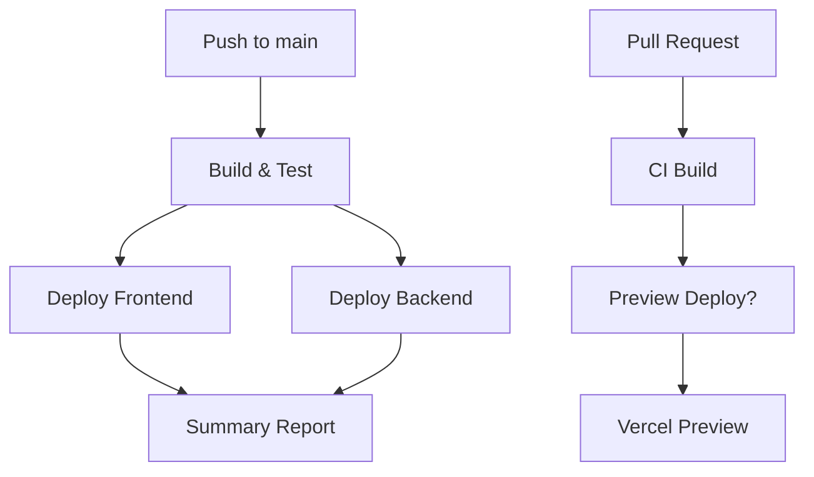

# ✅ GitHub Workflows - Setup Completo

Criei uma estrutura completa de GitHub Actions para deploy automático do seu projeto UniwSwap!

## 📁 Arquivos Criados

```
.github/
├── workflows/
│   ├── deploy-simple.yml    # 🚀 Workflow principal de deploy
│   ├── deploy.yml          # 🔧 Workflow completo (backup)
│   ├── preview.yml         # 🔧 CI para Pull Requests
│   └── README.md           # 📖 Documentação dos workflows
├── QUICK-START.md          # ⚡ Guia de setup rápido
└── SECRETS-SETUP.md        # 🔐 Guia detalhado de secrets
setup-deploy.ps1            # 🛠️ Script de setup (Windows)
setup-deploy.sh             # 🛠️ Script de setup (Linux/Mac)
```

## 🚀 Workflow Principal: `deploy-simple.yml`

### Recursos:
- ✅ Build automático do frontend
- ✅ Deploy no Vercel (frontend)
- ✅ Deploy no Fly.io (backend)
- ✅ Relatório detalhado de deployment
- ✅ Tratamento de erros robusto
- ✅ Execução apenas na branch `main`

### Gatilhos:
- Push na branch `main`
- Execução manual via GitHub Actions

## 🔧 Workflow de Preview: `preview.yml`

### Recursos:
- ✅ CI automático para Pull Requests
- ✅ Build e testes em PRs
- ✅ Preview deployment (opcional, com label 'preview')
- ✅ Relatório de build size
- ✅ Verificação de qualidade

## 🔐 Secrets Necessários

Configure no GitHub (Settings → Secrets and variables → Actions):

| Secret | Descrição |
|--------|-----------|
| `VERCEL_TOKEN` | Token de API do Vercel |
| `VERCEL_ORG_ID` | ID da organização Vercel |
| `VERCEL_PROJECT_ID` | ID do projeto Vercel |
| `FLY_API_TOKEN` | Token de API do Fly.io |

## 📋 Próximos Passos

### 1. Configure os Secrets
```powershell
# Execute o script de setup
.\setup-deploy.ps1
```

### 2. Obtenha os Tokens
- **Vercel**: https://vercel.com/account/tokens
- **Fly.io**: `flyctl auth token`
- **Vercel IDs**: `cd frontend && npx vercel link`

### 3. Faça o Deploy
```bash
git add .
git commit -m "feat: setup github actions deploy"
git push origin main
```

### 4. Monitore
- Vá na aba **Actions** do GitHub
- Aguarde o workflow completar
- Acesse sua aplicação!

## 🎯 Fluxo de Trabalho



## 🔍 Monitoramento

### Durante o Deploy:
- 👀 GitHub Actions (aba Actions)
- 📊 Summary com status detalhado
- 🔗 Links automáticos para aplicações

### Após o Deploy:
- 🌍 **Frontend**: https://your-app.vercel.app
- ☁️ **Backend**: https://uniwswap-backend.fly.dev
- 🩺 **Health Check**: https://uniwswap-backend.fly.dev/health

## 🛠️ Troubleshooting

### ❌ Deploy falha?
1. Verifique os secrets no GitHub
2. Execute o script de setup local: `.\setup-deploy.ps1`
3. Teste o build: `cd frontend && npm run build`
4. Veja logs detalhados na aba Actions

### ❌ Vercel falha?
- Confirme tokens em vercel.com/account/tokens
- Execute: `cd frontend && npx vercel link`
- Verifique se o projeto está linkado

### ❌ Fly.io falha?
- Teste: `flyctl auth whoami`
- Verifique: `flyctl apps list`
- Confirme se o app existe

## 📚 Documentação

- 📖 **Workflows**: `.github/workflows/README.md`
- ⚡ **Setup Rápido**: `.github/QUICK-START.md`
- 🔐 **Secrets**: `.github/SECRETS-SETUP.md`

## 🎉 Resultado Final

Após a configuração:
- ✅ Deploy automático a cada push na main
- ✅ CI/CD completo com verificações
- ✅ Preview deployments para PRs
- ✅ Monitoramento e relatórios detalhados
- ✅ Tratamento robusto de erros

**Seu projeto agora tem deploy profissional e automatizado! 🚀**